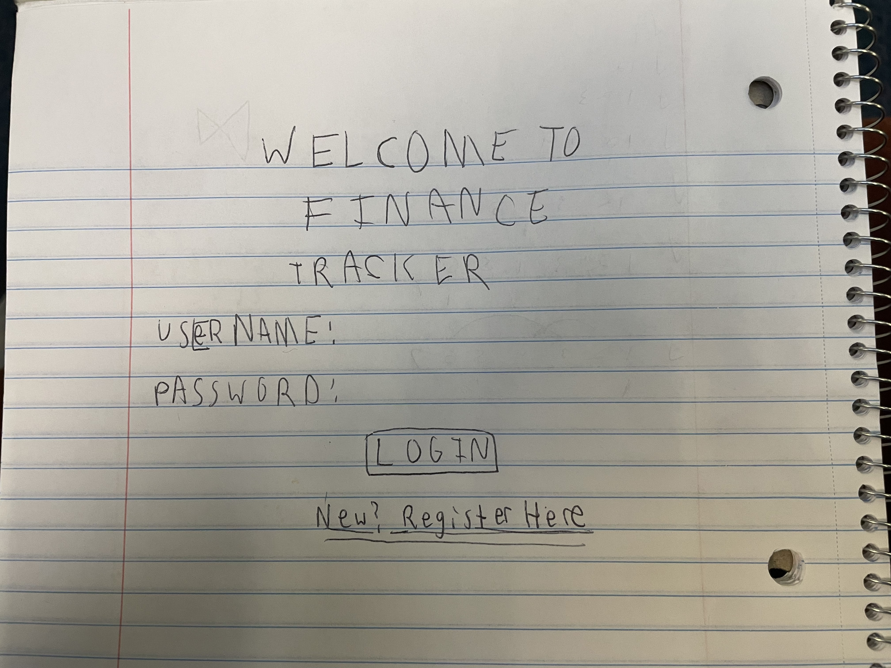
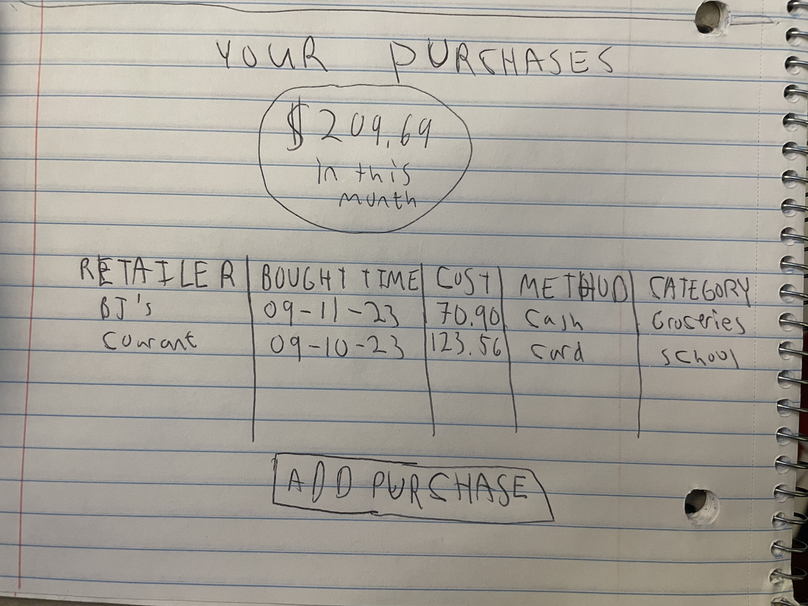
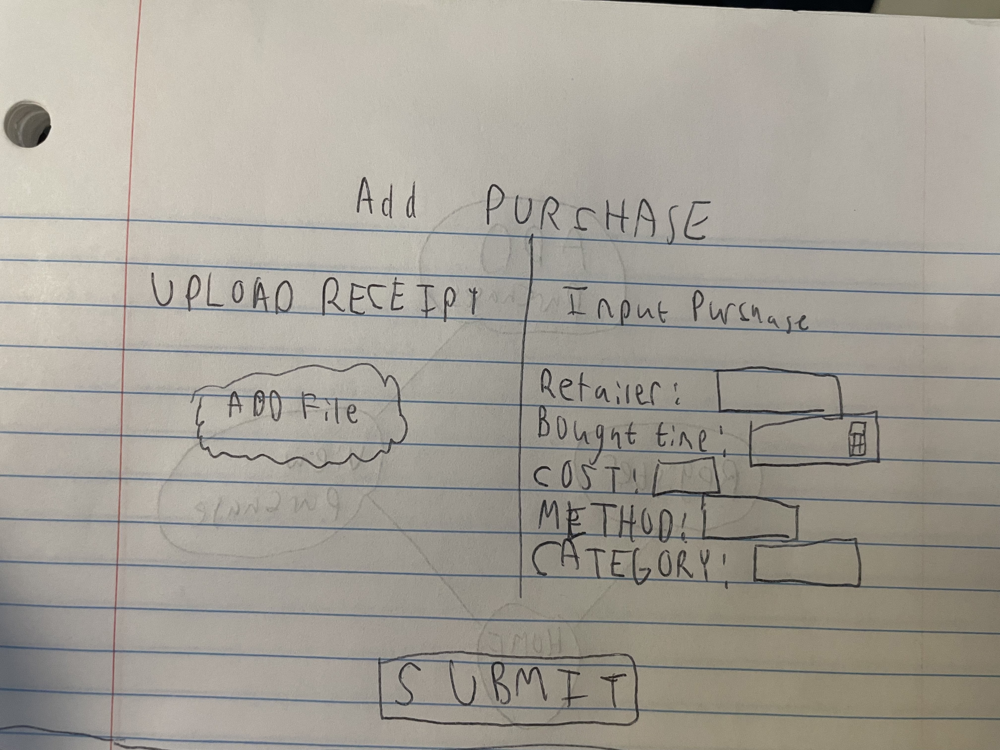
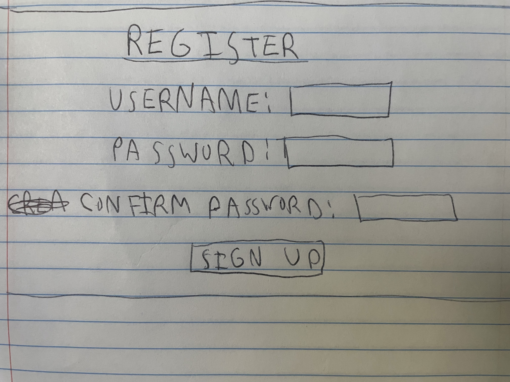
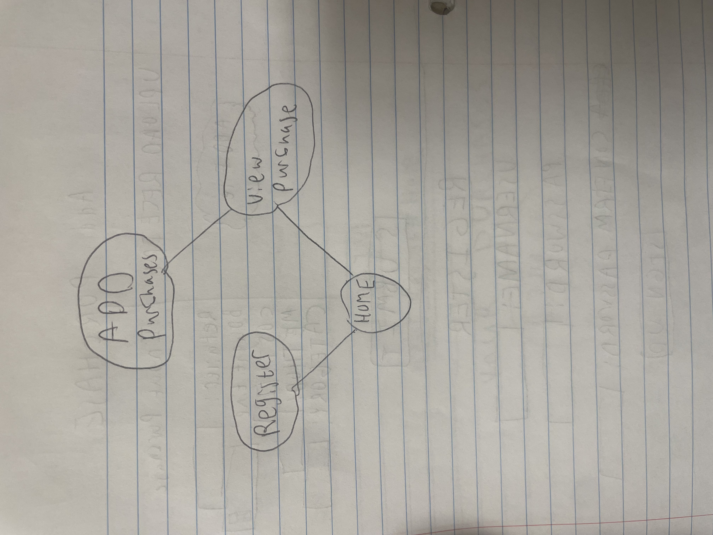

# Milestone 2


# Finance Tracker

## Overview

Paying with multiple cards, paying in cash, paying online, and even paying subscriptions make money management and finance tracking even more difficult than ever. Without a centralized portal to view all your purchases consumers stay losing and big corporations are winning. This is where our Finance Tracker comes in.

The Finance Tracker is a web app that will let users view and track every purchase from all their cards. Furthermore, users can view different graphs, tables, and charts for their purchases to visualize how they spend. Once users register/login, they can add to their purchases by hand, or scan receipts for quick uploads. The Tracker will use this user-provided purchase information to monitor user purchase history 


## Data Model

The application will store Users and purchases

An Example User:

```javascript
{
  username: "shannonshopper",
  pw: // a password hash,
  purchases: // an array of references to purchase documents
}
```

An Example Purchase:

```javascript
{
  PurchaseID: // an ID for the purchase
  Retailer: "Stop&Shop",
  BoughtTime: 1-20-2023// timestamp
  Cost: 17.92// cost of purchase
  PaymentMethod: "Chase Bank Card"
  Category: "Groceries"
}
```


## [Link to Commented First Draft Schema](db.mjs) 

## Wireframes

/home - Welcome page for Users to log in/register



/purchases - page for showing all purchases as well as visualizations for spending



/addPurchase - page for adding a purchase



/Register - page for creating new user



## Site map



## User Stories or Use Cases

1. as non-registered user, I can register a new account with the site
2. as a user, I can log in to the site
3. as a user, I can create a new Purchase
4. as a user, I can view all of the grocery lists I've created in a single list
5. as a user, I can modify any column of existing purchases 
6. as a user, I can view visualizations of my purchases

## Research Topics

* (5 points) Integrate user authentication
    * I'm going to be using passportjs for user authentication
    * It's highly customizable and has the easiest integration without sacrificing security.
    * I thought about using Firebase, but it doesn't have the same ease of integration as passport, though it still is just as good an option to use.
    * An account will be made for testing; I'll email you the password
* (4 points) NPM Receipt-Scanner Library
    * Learn how to use Receipt Scanner Library to parse receipts
    * Chose to use this library as it is free (unlike most) and has flexible text parsing
    * Will have to learn how to integrate Scanner text with backend, so giving this 4 points
* (3 points) React.js
    * used React.js as the frontend framework; Not an easy Library to learn and will not be covered until end of project, so I will have to learn it on my own. Giving points

12 points total out of 10 required points


## [Link to Initial Main Project File](app.mjs) 


## Annotations / References Used

1. [Receipt Scanner docs](https://www.npmjs.com/package/receipt-scanner?activeTab=readme)
